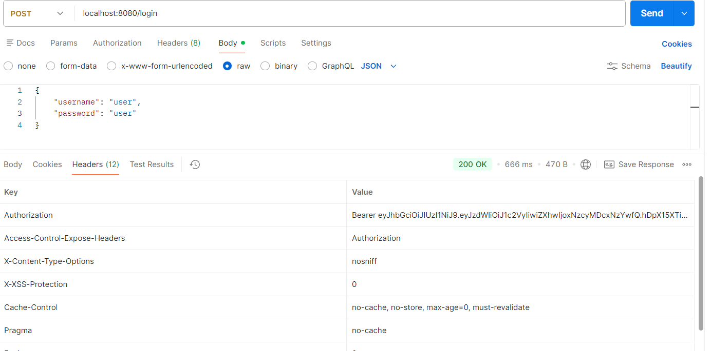
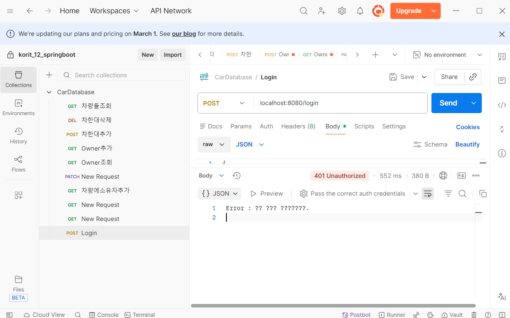

# 입실 체크 해주세요 !! 🎈

## 금일 수업 계획
1. JWT

## JWT로 백엔드 보호하기
- 어제까지의 수업에서 RESTful 웹 서비스에서의 기본 인증(postman 상에서 basic auth)을 이용하는 방법을 학습했습니다. 기본 인증이란 토큰을 처리하거나 세션을 관리하는 방법이 포함되지 않습니다. 해당 방식은 사용자가 로그인할 때 각 요청과 함께 자격 증명이 함께 전송되므로 보안 상의 문제가 있을 수 있습니다. 그리고 해당 방식은 리액트로 자체 프론트엔드를 개발할 때 이용하는 것이 불가능합니다. 대신 JWT를 이용한 인증 방법을 사용할 예정입니다.

### JWT 란 ?
- 인증 구현 방법 중 하나, 인증 및 권한 부여(Authentication & Authorization) 목적으로 RESTful API에서 가장 보편적으로 사용됩니다.
- 인증(Authentication) : 보통 로그인 과정과 관련
- 인가/권한부여(Authorization) : 특정 역할이 특정 페이지를 들어갈 수 있는지 없는지에 여부
    - 즉, 인증은 받았기 때문에 로그인이 가능하긴 하지만, 회원이 다른 회원을 삭제할 권한은 없는 반면에, 관리자는 다른 회원을 조회하거나 삭제하는 권한을 가질 수도 있음. 즉, 인증 이후의 특정 HTTP 요청에 관한 권한에 가깝습니다.
- JWT 자체는 크기가 매우 작기 때문에 URL / POST 매개변수 또는 헤더 내부에 담아서 전송하는 것이 가능합니다. 본시 수업 중에는 postman 상에서의 요청을 할 때 예시를 제공 예정.
- JWT 내부에는 사용자 이름과 역할 등 필수적인 정보를 담는 것이 가능
### JWT의 구조

- header : 토큰의 유형과 해싱 알고리즘을 정의
- payload : 인증에서 일반적으로 사용자 정보를 포함.
- signiture : 토큰이 도중에 변경되지 않았는지 확인하는 데 이용

- 이상의 이미지에서 '.' 을 기준으로 header / payload / signiture가 분리됩니다. 
- JWT는 인증에 성공한 후 클라이언트가 전송하는 요청에는 항상 인증 시 받은 JWT가 반드시 포함되어야 합니다.
### JWT 생성 및 해석과 응용 과정
1. build.gradle에 의존성 추가
```java
	implementation 'io.jsonwebtoken:jjwt-api:0.13.0'
	runtimeOnly 'io.jsonwebtoken:jjwt-impl:0.13.0'
	runtimeOnly 'io.jsonwebtoken:jjwt-jackson:0.13.0'
```

2. 서명된 JWT를 생성하고 검증하는 클래스를 만들어야 합니다. service 패키지 내에 JwtService라는 클래스를 생성하시오.

```java
package com.korit12.cardatabase.service;

import org.springframework.stereotype.Service;

@Service
public class JwtService {
    // 1일(밀리초 기준) - 실제 운영에서는 좀 더 짧게 잡습니다
    static final long EXPIRATIONTIME = 86400000;
    static final String PREFIX = "Bearer";
}
```
- PREFIX는 토큰의 접두사를 의미하며, 일반적으로 "Bearer" 스키마가 사용됩니다. JWT Authorization 헤더에 담겨서 전송되며, Bearer 스키마를 이용하는 경우 헤더의 내용은 이하와 같습니다.

`Authorization: Bearer <token>`

3. jjwt 라이브러리 내의 secretKeyFor() 메서드를 활용하여 비밀 키를 생성할겁니다. 시연용으로만 사용되고 실제 운영환경에서는 애플리케이션 구성에서 비밀 키를 읽어야 합니다. 이후 getToken() 메서드가 토큰을 생성하고 return할겁니다. getAuthUser() 메서드를 통해 응답의 Authorization 헤더에서 토큰을 가져옵니다. 그리고 parser() 메서드를 통해 JwtParser 인스턴스를 생성할겁니다. setSigningKey() 메서드를 통해 토큰 확인을 위한 비밀 키를 지정하는 데 이용할거고, parseClaimsJws() 메서드를 통해 Authorization 헤더에서 Bearer 접두사를 또 제거할겁니다. 마지막으로 getSubject() 메서드를 이용하여 사용자 이름을 가져올겁니다.

전체 코드는 이하와 같습니다.

```java
package com.korit12.cardatabase.service;

import io.jsonwebtoken.Jwts;
import io.jsonwebtoken.SignatureAlgorithm;
import io.jsonwebtoken.security.Keys;
import jakarta.servlet.http.HttpServletRequest;
import org.springframework.http.HttpHeaders;
import org.springframework.stereotype.Service;

import javax.crypto.SecretKey;
import java.util.Date;

@Service
public class JwtService {
    // 1일(밀리초 기준) - 실제 운영에서는 좀 더 짧게 잡습니다
    static final long EXPIRATIONTIME = 86400000;
    static final String PREFIX = "Bearer ";

    static final SecretKey KEY = Keys.secretKeyFor(SignatureAlgorithm.HS256);

    // 토큰 생성
    public String getToken(String username) {
        return Jwts.builder()
                .subject(username)
                .expiration(new Date(System.currentTimeMillis() + EXPIRATIONTIME))
                .signWith(KEY)
                .compact();
    }

    // 토큰 검증 및 username 추출
    public String getAuthUser(HttpServletRequest request) {
        String token = request.getHeader(HttpHeaders.AUTHORIZATION);

        if (token != null && token.startsWith(PREFIX)) {
            // "Bearer " 접두사를 제거하는 과정
            String authToken = token.substring(PREFIX.length()).trim();

            String user = Jwts.parser()
                    .verifyWith(KEY)
                    .build()
                    .parseSignedClaims(authToken)
                    .getPayload()
                    .getSubject();

            if(user != null) {
                return user;
            }
        }
        return null;
    }
}
```

- jjwt의 버전이 12 이후로 바뀜에 따라 원래는 parserBuilder()라고하는 메서드였다가 parse()로 변경이 되었었습니다. 그래서 특정 버전을 이용해야하는 경우도 있어서 지난 기수까지는 11로 다운그레이드했었으나 이번에는 최신 위주로 가고 있습니다.

4. 다음으로 인증을 위한 자격 증명을 저장하는 새로운 클래스를 추가할겁니다. 여기서 또 새로운 자료형 학습할겁니다. Record라고 하는 자료형을 생성. Record는 데이터만 보관하는 클래스가 필요할 때 보일러플레이트를 안 써도 되는 자료형으로 Java14에서 추가되었습니다.
    - domain 패키지 내에 AccountCredentials 생성
```java
package com.korit12.cardatabase.domain;

public record AccountCredentials(String username, String password) {
}
```
5. Login을 위한 Controller 클래스를 구현할겁니다(Web 요청의 가장 최전선에 있는 백엔드가 Controller 클래스라고 했습니다).

```java
package com.korit12.cardatabase.web;

import com.korit12.cardatabase.domain.AccountCredentials;
import com.korit12.cardatabase.service.JwtService;
import lombok.AllArgsConstructor;
import org.springframework.http.ResponseEntity;
import org.springframework.security.authentication.AuthenticationManager;
import org.springframework.web.bind.annotation.PostMapping;
import org.springframework.web.bind.annotation.RequestBody;
import org.springframework.web.bind.annotation.RestController;

@RestController
@AllArgsConstructor
public class LoginController {
    private JwtService jwtService;
    private AuthenticationManager authenticationManager;

    // 로그인이니까 POST 요청이어야겠네요.
    @PostMapping("/login")
    public ResponseEntity<?> getToken(@RequestBody AccountCredentials credentials) {
        // 여기에 토큰 생성하고 응답의 Authorization 헤더로 전송해주는 로직을 작성할 예정입니다.
    }
}
```
- 필요 학습 내용 정리
1. ResponseEntity 클래스
    - 정의
        - ResponseEntity는 Spring에서 HTTP 응답 전체를 나타내는 클래스로, 그래서 Controller 클래스에서 쓰입니다. 웹 애플리케이션 컨트롤러 클래스에서 ResponseEntity 클래스를 return하면, 개발자가 응답의 데이터(Body), HTTP 상태 코드(Status Code), 그리고 HTTP headers를 명시적으로 제어하는 것이 가능합니다.

        - RESTful API 설계에서 서버의 상태를 클라이언트에게 정확하게 전달하는 데 필수적.

    - 주요 특징 및 구성 요소
        1. Body(본문)
            - 클라이언트에게 실제로 전송되는 데이터 제네릭 `<>`으로 지정됨.
            - `User` 객체, `List<Product>` 등(JSON 형태로 변환되어 전송됨. - postman에서 차 등록할 때 JSON으로 보냈고, backend에서 Java 객체로 변환된 뒤에 -> MariaDB에 저장됐습니다).
        2. Status Code(상태코드)
            - 요청 처리 결과를 나타내는 3 자리 숫자.
                1. HttpStatus.OK - 200
                2. HttpStatus.CREATED - 201
                3. HttpStatus.NOT_FOUND - 404
        3. Headers
            - 응답에 대한 추가적인 메타 데이터
                1. HttpHeaders.CONTENT_TYPE
                2. HttpHeaders.AUTHORIZATION
                3. HttpHeaders.LOCATION
```java
package com.korit12.cardatabase.config;

import com.korit12.cardatabase.service.UserDetailsServiceImpl;
import lombok.AllArgsConstructor;
import org.springframework.context.annotation.Bean;
import org.springframework.context.annotation.Configuration;
import org.springframework.http.HttpMethod;
import org.springframework.security.authentication.AuthenticationManager;
import org.springframework.security.config.annotation.authentication.builders.AuthenticationManagerBuilder;
import org.springframework.security.config.annotation.authentication.configuration.AuthenticationConfiguration;
import org.springframework.security.config.annotation.web.builders.HttpSecurity;
import org.springframework.security.config.annotation.web.configuration.EnableWebSecurity;
import org.springframework.security.config.http.SessionCreationPolicy;
import org.springframework.security.crypto.bcrypt.BCryptPasswordEncoder;
import org.springframework.security.crypto.password.PasswordEncoder;
import org.springframework.security.web.SecurityFilterChain;

@Configuration
@EnableWebSecurity
@AllArgsConstructor
public class SecurityConfig {
    private UserDetailsServiceImpl userDetailsService;

    public void configureGlobal(AuthenticationManagerBuilder auth) throws Exception {
        auth.userDetailsService(userDetailsService);
    }

    @Bean
    public PasswordEncoder passwordEncoder() {
        return new BCryptPasswordEncoder();
    }

    @Bean
    public AuthenticationManager authenticationManager(AuthenticationConfiguration authConfig) throws Exception {
        return authConfig.getAuthenticationManager();
    }

    @Bean
    public SecurityFilterChain filterChain(HttpSecurity http) throws Exception {
        http
                .csrf(csrf -> csrf.disable())
                .sessionManagement(sessionManagement
                        -> sessionManagement.sessionCreationPolicy(SessionCreationPolicy.STATELESS))
                .authorizeHttpRequests(authorizeHttpRequests
                        -> authorizeHttpRequests.requestMatchers(HttpMethod.POST, "/login").permitAll().anyRequest().authenticated());
        return http.build();
    }
}
```
- 이상에서 주목해야 할 메서드는 filterChain 메서드입니다. SecurityFilterChain 빈은 어떤 경로가 보호되고, 어떤 경로가 보호되지 않는지를 정의합니다. 메서드 내부를 보시면 "/login" 경로의 POST 요청에 대해서는 permitAll()이라는 메서드가 붙어있습니다.
`authorizeHttpRequests.requestMatchers(HttpMethod.POST, "/login").permitAll().anyRequest().authenticated()` 그래서 이 코드를 굳이 해석해보자면, /login 엔드포인트의 POST 요청에 대해서는 permitAll()이기 때문에 JWT가 없어도 요청 가능. 하지만 나머지(anyRequest())의 경우에는 인가(authenticated())가 필요.

이상의 과정이 모두 해결되게 되면 postman을 통해서 login 요청을 할 수 있게 됩니다.


요청 결과의 headers의 authorization을 확인하게 되면 Bearer + 토큰 형태의 데이터가 있음을 확인할 수 있습니다.

즉, 로그인 요청이 성공했기 때문에 JwtService에 있는 getToken() 메서드의 호출이 성공적으로 이루어졌다고 볼 수 있겠습니다.

## 다른 요청들 보호하기

1. 루트 패키지에 AuthenticationFilter 클래스를 생성하겠습니다. 얘는 Spring Security 상에서의 OncePerRequestFilter 인터페이스를 확장 구현하여 인증을 쓰는 doFilterInternal 메서드를 제공합니다.
```java
package com.korit12.cardatabase;

import com.korit12.cardatabase.service.JwtService;
import jakarta.servlet.FilterChain;
import jakarta.servlet.ServletException;
import jakarta.servlet.http.HttpServletRequest;
import jakarta.servlet.http.HttpServletResponse;
import lombok.AllArgsConstructor;
import org.springframework.http.HttpHeaders;
import org.springframework.security.authentication.UsernamePasswordAuthenticationToken;
import org.springframework.security.core.Authentication;
import org.springframework.security.core.context.SecurityContextHolder;
import org.springframework.stereotype.Component;
import org.springframework.web.filter.OncePerRequestFilter;

import java.io.IOException;
import java.util.Collections;

@Component
@AllArgsConstructor
public class AuthenticationFilter extends OncePerRequestFilter {
    private JwtService jwtService;
    
    @Override
    protected void doFilterInternal(HttpServletRequest request, HttpServletResponse response, FilterChain filterChain) throws ServletException, IOException {
        // 토큰 검증 및 사용자 가져오기
        String jws = request.getHeader(HttpHeaders.AUTHORIZATION);
        if(jws != null) {
            String user = jwtService.getAuthUser(request);
            // 인증하기
            Authentication authentication = new UsernamePasswordAuthenticationToken(user, null, Collections.emptyList());

            SecurityContextHolder.getContext().setAuthentication(authentication);
        }
        filterChain.doFilter(request, response);
    }
}
```
- SecurityContextHolder는 스프링 시큐리티가 인증된 사용자의 세부 정보를 저장하는 곳에 해당합니다. 그리고 이 클래스에서 doFilter()라는 메서드를 정의해뒀는데, 이를 호출하는 단계를 생각하셔야 합니다. -> 요청을 날릴 때 마다 확인해야 하기 때문에 SecurityConfig 클래스의 filterChain() 메서드 내에서 사용되어야 합니다.

```java
package com.korit12.cardatabase.config;

import com.korit12.cardatabase.AuthenticationFilter;
import com.korit12.cardatabase.service.UserDetailsServiceImpl;
import lombok.AllArgsConstructor;
import org.springframework.context.annotation.Bean;
import org.springframework.context.annotation.Configuration;
import org.springframework.http.HttpMethod;
import org.springframework.security.authentication.AuthenticationManager;
import org.springframework.security.config.annotation.authentication.builders.AuthenticationManagerBuilder;
import org.springframework.security.config.annotation.authentication.configuration.AuthenticationConfiguration;
import org.springframework.security.config.annotation.web.builders.HttpSecurity;
import org.springframework.security.config.annotation.web.configuration.EnableWebSecurity;
import org.springframework.security.config.http.SessionCreationPolicy;
import org.springframework.security.crypto.bcrypt.BCryptPasswordEncoder;
import org.springframework.security.crypto.password.PasswordEncoder;
import org.springframework.security.web.SecurityFilterChain;
import org.springframework.security.web.authentication.UsernamePasswordAuthenticationFilter;

@Configuration
@EnableWebSecurity
@AllArgsConstructor
public class SecurityConfig {
    private UserDetailsServiceImpl userDetailsService;
    private AuthenticationFilter authenticationFilter;

    public void configureGlobal(AuthenticationManagerBuilder auth) throws Exception {
        auth.userDetailsService(userDetailsService);
    }

    @Bean
    public PasswordEncoder passwordEncoder() {
        return new BCryptPasswordEncoder();
    }

    @Bean
    public AuthenticationManager authenticationManager(AuthenticationConfiguration authConfig) throws Exception {
        return authConfig.getAuthenticationManager();
    }

    @Bean
    public SecurityFilterChain filterChain(HttpSecurity http) throws Exception {
        http
                .csrf(csrf -> csrf.disable())
                .sessionManagement(sessionManagement
                        -> sessionManagement.sessionCreationPolicy(SessionCreationPolicy.STATELESS))
                .authorizeHttpRequests(authorizeHttpRequests
                        -> authorizeHttpRequests.requestMatchers(HttpMethod.POST, "/login").permitAll().anyRequest().authenticated())
                .addFilterBefore(authenticationFilter, UsernamePasswordAuthenticationFilter.class);
        return http.build();
    }
}

```

private AuthenticationFilter authenticationFilter; 추가했습니다 -> AllArgsConstructor 때문에 자동으로 생성자가 갱신됩니다.


그리고 `.addFilterBefore(authenticationFilter, UsernamePasswordAuthenticationFilter.class);` 추가했습니다.

## 예외 처리하기
- 현재 잘못된 암호를 이용하여 로그인을 시도했을 경우를 상정하겠습니다. 현재는 403으로 나오기만 합니다. Basic Auth 이용했을 때는 401이라고 안내했었는데 차이가 있습니다. 이는 적절한 로그가 안내되지 않기 때문에 협업 시에 문제가 될 수 있습니다. 그래서 예외가 발생하면 401이 뜨도록 커스텀하겠습니다.

1. 루트 패키지에 AuthenticationEntryPoint를 _구현_ 하는 AuthEntryPoint 클래스를 생성하겠습니다. implements 받고 뻘건 줄 여러분들이 없애보겠습니다.


403 -> 401로 바뀌었습니다. : `response.setStatus(HttpServletResponse.SC_UNAUTHORIZED);` 로 저희가 커스텀해뒀기 때문입니다.
그리고 원래 로그인 실패시에는 body 란에 아무 것도 뜨지 않았는데, Error: ?? ??? 어쩌고 떠있습니다.
얘는
`writer.println("Error : " + authException.getMessage());` 이거 때문이겠네요. 즉, writer 객체를 생성해서 print 메서드를 호출하여 오류 로그에 대한 안내 메시지를 JSON으로 받아볼 수 있게끔 작성했습니다.

## CORS 필터 추가하기
CORS(Cross Origin Resources Sharing)는 클라이언트와 서버가 교차 출처(source) 재요청을 허용하게 할 지 거부할지를 결정하게 하는 특정 헤더를 도입합니다. backend:8080 / front:5173로 기본 할당이 되는데 백-프론트가 서로 통신하는 과정 상에서 요청 거부가 자주 일어납니다.

CORS 필터는 다른 출처에서 요청을 보내는 프론트엔드에서 필요합니다. CORS는 요청을 가로채고(intercept), 교차 출처로 식별되면(서로 연결관계가 있다면) 요청에 적절한 header를 추가해줍니다.

- Spring Security의 CorsConfigurationSource 인터페이스를 이용할겁니다.

- 저희 예제에서는 모든 출처의 HTTP 메서드와 헤더를 허용하게끔 작성할겁니다. 나중에 여러분들의 프로젝트에 따라 커스텀이 요구될 수 있습니다.

```java
package com.korit12.cardatabase.config;

import com.korit12.cardatabase.AuthEntryPoint;
import com.korit12.cardatabase.AuthenticationFilter;
import com.korit12.cardatabase.service.UserDetailsServiceImpl;
import lombok.AllArgsConstructor;
import org.jspecify.annotations.NonNull;
import org.springframework.context.annotation.Bean;
import org.springframework.context.annotation.Configuration;
import org.springframework.http.HttpMethod;
import org.springframework.security.authentication.AuthenticationManager;
import org.springframework.security.config.Customizer;
import org.springframework.security.config.annotation.authentication.builders.AuthenticationManagerBuilder;
import org.springframework.security.config.annotation.authentication.configuration.AuthenticationConfiguration;
import org.springframework.security.config.annotation.web.builders.HttpSecurity;
import org.springframework.security.config.annotation.web.configuration.EnableWebSecurity;
import org.springframework.security.config.http.SessionCreationPolicy;
import org.springframework.security.crypto.bcrypt.BCryptPasswordEncoder;
import org.springframework.security.crypto.password.PasswordEncoder;
import org.springframework.security.web.SecurityFilterChain;
import org.springframework.security.web.authentication.UsernamePasswordAuthenticationFilter;
import org.springframework.web.cors.CorsConfiguration;
import org.springframework.web.cors.CorsConfigurationSource;
import org.springframework.web.cors.UrlBasedCorsConfigurationSource;
import java.util.Arrays;

import static org.springframework.security.config.Customizer.withDefaults;

@Configuration
@EnableWebSecurity
@AllArgsConstructor
public class SecurityConfig {
    private UserDetailsServiceImpl userDetailsService;
    private AuthenticationFilter authenticationFilter;
    private AuthEntryPoint exceptionHandler;

    public void configureGlobal(@NonNull AuthenticationManagerBuilder auth) throws Exception {
        auth.userDetailsService(userDetailsService);
    }

    @Bean
    public PasswordEncoder passwordEncoder() {
        return new BCryptPasswordEncoder();
    }

    @Bean
    public AuthenticationManager authenticationManager(AuthenticationConfiguration authConfig) throws Exception {
        return authConfig.getAuthenticationManager();
    }

    @Bean
    public SecurityFilterChain filterChain(HttpSecurity http) throws Exception {
        http
                .csrf(csrf -> csrf.disable())
                .cors(withDefaults())
                .sessionManagement(sessionManagement
                        -> sessionManagement.sessionCreationPolicy(SessionCreationPolicy.STATELESS))
                .authorizeHttpRequests(authorizeHttpRequests
                        -> authorizeHttpRequests.requestMatchers(HttpMethod.POST, "/login").permitAll().anyRequest().authenticated())
                .addFilterBefore(authenticationFilter, UsernamePasswordAuthenticationFilter.class)
                .exceptionHandling(exceptionHandling
                        -> exceptionHandling.authenticationEntryPoint(exceptionHandler));
        return http.build();
    }

    // 클래스 내에 전역 CORS 필터 추가
    @Bean
    public CorsConfigurationSource corsConfigurationSource() {
        UrlBasedCorsConfigurationSource source = new UrlBasedCorsConfigurationSource();
        CorsConfiguration config = new CorsConfiguration();
        config.setAllowedOrigins(Arrays.asList("*"));
        config.setAllowedMethods(Arrays.asList("*"));
        config.setAllowedHeaders(Arrays.asList("*"));
        config.setAllowCredentials(false);
        config.applyPermitDefaultValues();
        
        source.registerCorsConfiguration("/**", config);
        
        return source;
    }
}
```
특정 url에 대해서만 요청을 허용하려면 `config.setAllowedOrigins(Arrays.asList("*"));` 부분을 수정하시면 됩니다.
`config.setAllowedOrigins(Arrays.asList("http://localhost:5173"));`


# Role-based Security

Spring Security에서는 역할을 이용하여 세분화된 역할 기반 보안을 정의하는 것이 가능하며, 사용자는 하나 혹은 여러 개의 역할에 할당되어질 수 있습니다. 역할은 흔히 ADMIN, MANAGER, USER 같은 계층 구조를 가집니다. 예를 들어서 키오스크를 기준으로 했을 때, 음료 주문한다면 비회원은 역할이 없거나 USER에 해당될 것이고, 가맹점주는 MANAGER일겁니다. 그리고 가끔 수리하러 오거나 본사 사람은 ADMIN이 되겠네요. 이 때 ADMIN은 MANAGER의 권한 대부분을 가질 수 있다는 점에서 계층적이라고 할 겁니다.

역할 기반 접근 제어를 SecurityConfig 에서 정의할 수 있습니다. 이하의 예시에서 특정 역할이 필요한 엔드포인트를 따로 정의할겁니다. `/admin/**`엔드포인트에 접근하려면 ADMIN 역할을 가지고 있고, `/user/**`엔드포인트에 접근하려면 USER 역할을 필요하게끔 하는 예시입니다.

```java
@Bean
public SecurityFilterChain filterChain(HttpSecurity http) throws Exception {
    http
      .csrf(csrf -> csrf.disable())
      .cors(withDefaults())
      .sessionManagement(sessionManagement
              -> sessionManagement.sessionCreationPolicy(SessionCreationPolicy.STATELESS))
      .authorizeHttpRequests(authorizeHttpRequests
              -> authorizeHttpRequests.requestMatchers("/admin/**").hasRole("ADMIN").requestMatchers("/user/**").hasRole("USER").anyRequest().authenticated())
      .addFilterBefore(authenticationFilter, UsernamePasswordAuthenticationFilter.class)
      .exceptionHandling(exceptionHandling
              -> exceptionHandling.authenticationEntryPoint(exceptionHandler));
    return http.build();
}
```